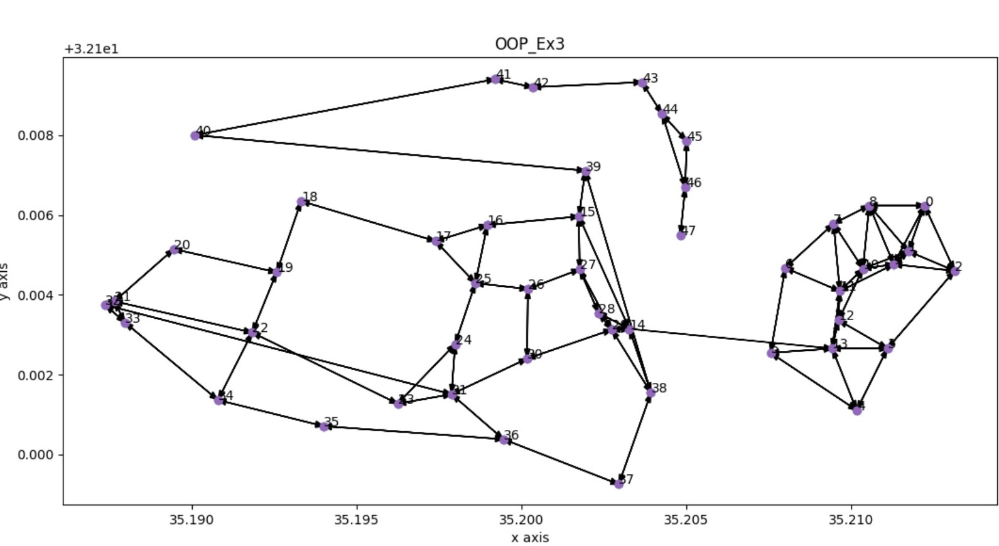

# OOP_Ex3 

## About the project:

The project is about programming a data structure called a directional weighted graph in python, which worked with three main algorithms: shortest path, connected component and connected components.

The main idea of the project is to examine the results of the implementation of the algorithms mentioned above, on Python, Java and NetworkX and compare the runtimes results between those different programs.

:bar_chart: For the comparing results please view the Wiki page.

### About the graph:

***description:***

The directional weighted graph is a data structure in which every edge has a direction and a weight (positive number).
This data structure contains vertexes from the type of node_data.

For creating the graph we program tree new classes-  NodeData, DiGraph, and GraphAlgo -every class implements an interface, which includes functions.

:mag: **NodeData:**

This class implements the functions of the interface called 'node_data', and represent a vertex in the graph.

Every node_data has a unique key, a position in space, weight, tag and info(remark fields), and two dictionaries:

'dest'(key, weight): containing all the edges which getting out of this vertex

'src'(key, weight): containing all the edges which getting in of this vertex.

The functions which applicable on a vertex:

- add_dest(dest: int, weight: float): connecting an edge between self --> dest with the given weight.

- add_src(src: int, weight: float): connecting an edge between src --> self with the given weight. 

- has_dest(dest: int, weight: float = None): checking if there is an  edge between self--> dest with the given weight.

- has_src(src: int): checking if there is an edge between src--> self with the given weight.

- remove_dest(dest: int): removing the given dest from the 'dest' dictionary.

- remove_src(src: int): removing the given src from the 'src' dictionary.

- get_dest(): return a dictionary (key, weight) of all the edges which getting out of this vertex.

- get_src(): return a dictionary (key, weight) of all the edges which getting in of this vertex.

- getWeight(dest: int): return the edge's weight between  self--> dest.

- get_key(): return the vertex's key.

- set_key(id: int): sets a new key to the vertex.

- get_pos(): returns the position of the vertex.

- set_pos(): sets the position of the vertex.

- get_weight(): returns the vertex's weight

- set_weight(): sets a new weight for the vertex.

- get_tag(): returns the vertex's tag .

- set_tag(): sets a new tag to the vertex.

- get_tag(): returns the vertex's info .

- set_tag(): sets a new info to the vertex.

:mag: **DiGraph:**

This class implements the functions of the interface called 'GraphInterface' and represents a directional weighted graph.

The graph contains a dictionary of vertexes (key, node_data), a number of the edges in the graph and the number of the changes which has been made in the graph.

The functions which applicable on the graph:

:small_orange_diamond: v_size(): returns the number of vertexes in this graph.
     
:small_orange_diamond: e_size(): returns the number of edges in this graph.
 
:small_orange_diamond: get_all_v(): retursn a dictionary of all the nodes in the Graph
       
:small_orange_diamond: all_in_edges_of_node(id1: int): returns a dictionary using a pair (key, weight), of all the nodes connected to (into) node_id.
       
:small_orange_diamond: all_out_edges_of_node(id1: int): returns a dictionary using a pair (key, weight), of all the nodes connected from node_id.
       
:small_orange_diamond: get_mc(): returns the current version of this graph.
       
:small_orange_diamond: add_edge(id1: int, id2: int, weight: float): adding an edge between id1 --> id2 to the graph.
     
:small_orange_diamond: add_node(node_id: int, pos: tuple = None): adding an vertex to the graph with the given id.
        
:small_orange_diamond: remove_node(node_id: int): removing a vertex from the graph according the given id.
       
:small_orange_diamond: remove_edge(node_id1: int, node_id2: int): removing the edge between id1 --> id2 from the graph.

:mag: **GraphAlgo:**

This class implements the functions of the interface called 'GraphAlgoInterface' and represents the algorithms which applicable on a directional weighted graph.

The algorithms are:

:small_blue_diamond: save_to_json(file_name: str): saving a graph in JSON format to a file.

:small_blue_diamond: load_from_json(file_name: str): loading a graph from a JSON file.

:small_blue_diamond: shortest_path(id1: int, id2: int) -> (path's distance, [id1 --> id2]): returns a tuple with the shortest path from node id1 to node id2 and the path's distance using Dijkstra's Algorithm.

:small_blue_diamond: connected_component(id1: int) -> list: returns a list with the id of the nodes which part of the Strongly Connected Component(SCC) of given node id.

:small_blue_diamond: connected_components() -> List[list]: returns a list of all check Strongly Connected Component(SCC) on the graph.

:small_blue_diamond: plot_graph(): ploting the graph, using matplotlib.pyplot .

:pushpin: Attached herein tree tests:

- test_nodedata: A simple test in which examine the integrity of the functions on  the class of 'NodeData'. 

- test_digraph: A test in which examine the integrity of the functions on the class of 'DiGraph'.
  
- test_graph_algo: A test  in which examine the integrity of the functions on the class of 'GraphAlgo', on both basic and extreme cases.

- test_compare_python: A test in which examine the algorithms of 'GraphAlgo' class, on the JSON files(A0-A5) in data's folder -on both basic and extreme cases.

:file_folder: data folder: https://github.com/ShiraAnaki130/OOP_Ex3/tree/master/data 

*How to use our project code?*

- [x] Download Pycharm.

- [x] Open a new folder.
  
- [x] Write on your new folder's Command Prompt the following commend: 

      git clone https://github.com/ShiraAnaki130/OOP_Ex3.git
  
- [x] Open the project 'OOP_Ex3' on Pycharm.

- [x] Install matplotlib.pyplot and numpy packages for plotting.

:lock: Please don't make any change on the codes without our permission.

Good luck!

:copyright: Lea Zuckerman and Shira Anaki.

